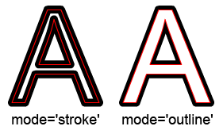
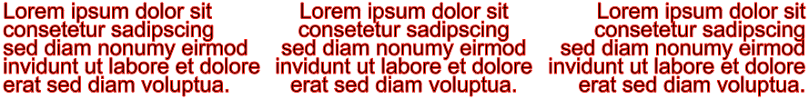

# Stroked TextField

Back in the glory days of Flash, developers often hoped for a feature to come into the Flashplayer one day: the ability to treat the look and color of the outlines of text independently from it's fill. But even the last release of the Flashplayer was lacking this functionality.
With [OpenFL](https://www.openfl.org "OpenFL") and the Haxe programming language things haven't changed. Not because it's impossible - just because OpenFL mimics the original ActionScript 3 API as close as possible.
With a little trickery you are able to fake stroked text using a **GlowFilter**. Unfortunately that filter is neither available on all of OpenFL's target platforms nor does the result look that good.

Based on an old libspark.org project called *RuntimeFontParser*, StrokedTextField achieves it's magic with a little trickery too:
Given a TrueType (.ttf) font file, it parses and extracts all of the glyph definitions stored inside. The extracted data is then used to trace the outlines of the font using plain moveTo(), lineTo() and curveTo() commands provided by the **openfl.display.Graphics** class later on.

This is just a short, abstract look behind the scenes though.
Wanna see something like this?

<p align="center"></p>

Getting started
==========

Install via haxelib:
```bash
haxelib install stroked-textfield
```
and add it to your OpenFL's project.xml file:
```xml
<haxelib name="stroked-textfield" />
```

As the library works with .ttf files on a binary level, we need to tell OpenFL where to look for the font files and also that it should treat those as binary data.
The **openfl.utils.Assets** class makes .ttf or .otf files accessible via the **openfl.text.Font** class, which is not what we want in this case.
Create a subfolder called e.g. **ttf** in your project's **assets/** folder and add this line to project.xml:
```xml
<assets path="assets/ttf" include="*.ttf" type="binary" />
```
Now we're able to get the binary data of a font file using `Assets.getBytes("assets/ttf/myFont.ttf")` for example.

Usage
=====

The heart of the library is the **StrokedTextField()** class, which inherits from **openfl.display.Shape** and as such can be added to the Displaylist using `addChild()` like any other DisplayObject. The constructor needs a single parameter, a **ByteArray** of the desired .ttf font file.
Let's start with a little 'Hello World' example. Put a .ttf font file into **assets/ttf** and remember it's filename.
Now open the $\color{#00f}{\textsf{Main.hx}}$ file of your project and paste the following lines:
```haxe
package;

import openfl.display.Sprite;
import openfl.Assets;

class Main extends Sprite
{
	public function new()
	{
		super();

		var tField:StrokedTextField = new StrokedTextField(Assets.getBytes("assets/ttf/arial.ttf"));
		tField.text = "Hello World";
		addChild(tField);
	}
}
```

substitue $\color{#00f}{\textsf{arial.ttf}}$ with the filename of your font and compile the project to your target of choice e.g. HTML5. If everything went well you should end up seeing something like this:
<p align="center"></p>

Though what you see is actually a two-colored something, it ain't too clear yet because the library's default font size of 24 paired with the default line width of 1 is rather small.

Luckily there's remedy. The StrokedTextField class offers a handful of properties which let you control the look of your text.
As we just heard of line width and font size, let's include the following four lines right after `tField.text = "Hello World";` and recompile.
```haxe
		tField.fontSize = 96;
		tField.lineStyle(4, 0x1a68cf, 1.0);
		tField.fill(0xcafc46, 1);
		tField.update();
```
<p align="center"></p>

| Property | Type | Description |
| --------- | ---- | ----------- |
| fontSize  | Float  | Controls the size of the rendered text and can be any positive number; defaults to 24 |

---

The **lineStyle(thickness, strokeColor, alpha)** method varies three properties of the stroked line at once.
| Parameter | Type | Description |
| --------- | ---- | ----------- |
| thickness  | Float  |  A positive number ranging from 0-255, specifying the thickness of the stroke; defaults to 1.0 |
| strokeColor  | UInt  |  The stroke's color in the form 0xRRGGBB; defaults to 0xff0000 |
| alpha  | Float  |  The opacity of the stroke ranging from 0.0 - 1.0, where 0 is transparent and 1 fully opaque; defaults to 1.0 |

---

Lastly, the **fill(fillColor, alpha)** method sets the fill of the text to a single solid color.
| Parameter | Type | Description |
| --------- | ---- | ----------- |
| fillColor  | UInt  |  Text color in the form 0xRRGGBB; defaults to 0x000000 |
| alpha  | Float  |  The opacity of the fill ranging from 0.0 - 1.0, where 0 is transparent and 1 fully opaque; defaults to 1.0 |

---

<table>
<thead>
  <tr>
    <td>:information_source:</td>
	<td>The use of the <b>update()</b> method might not be as obvious yet. Since the library has no control over OpenFL's internal rendering behaviour, a change to one of the StrokedTextField's properties would need to force a re-render of the complete textfield. As this has a rather high performance-impact, changes to any property except for <b>text</b> will <u>not</u> be visible until you call the <b>update()</b> method on the StrokedTextField's instance.</td>
  </tr>
</thead>
</table>

Complex Fills
=============

There are two additional methods that control the fill of the text:

**gradientFill(type, colors, alphas, ratios, matrix, spreadMethod)**

| Parameter | Type | Description |
| --------- | ---- | ----------- |
| type  | String  |  GradientType.LINEAR or GradientType.RADIAL |
| colors  | Array\<UInt\>  | An array of colors in the form 0xRRGGBB |
| alphas  | Array\<Float\>  | An array of opacity values for each of the gradient's colors |
| ratios  | Array\<Int\>  | The distribution of each color along the gradient |
| matrix  | Matrix  | A transformation matrix generated using the createGradientBox() method, which controls the rotation, scale, position and size of the gradient |
| spreadMethod  | String  | SpreadMethod.PAD, SpreadMethod.REPEAT or SpreadMethod.REFLECT  |
<p></p>

The **gradientFill()** method is almost identical to **openfl.display.Graphics.beginGradientFill()**.

Here's an example demonstrating the use of a gradient fill:
```haxe
package;

import openfl.display.Sprite;
import openfl.Assets;
import openfl.display.GradientType;
import openfl.display.SpreadMethod;
import openfl.geom.Matrix;

class Main extends Sprite
{
	public function new()
	{
		super();
		var tField:StrokedTextField = new StrokedTextField(Assets.getBytes("assets/ttf/arial.ttf"));
		tField.text = "Hello World";
		tField.lineStyle(2, 0x0000ff);
		var colors:Array<UInt> = [0xe8eb15, 0xeb1b0f];
		var alphas:Array<Float> = [1, 1];
		var ratios:Array<Int> = [0, 255];
		var matrix:Matrix = new Matrix();
		matrix.createGradientBox(400, 75, Math.PI / 2, 0, 0);
		tField.gradientFill(GradientType.LINEAR, colors, alphas, ratios, matrix, SpreadMethod.PAD);
		tField.fontSize = 96;
		tField.update();
		addChild(tField);
	}
}
```

<p align="center"></p>

---

**bitmapFill(bitmap, matrix, repeat, smooth)**

| Parameter | Type | Description |
| --------- | ---- | ----------- |
| bitmap  | BitmapData  | The image of your fill as an instance of **openfl.display.BitmapData**  |
| matrix  | Matrix  | A transformation matrix, which controls the rotation, scale, position and size of the bitmap fill |
| repeat  | Bool  | If the source bitmap is smaller than your fill, setting this to true will repeat the image  |
| smooth  | Bool  | If set to true, image upscaling will use a bilinear algorithm instead of nearest neighbor |

Sample usage:

```haxe
package;
import openfl.display.Sprite;
import openfl.Assets;
import openfl.geom.Matrix;

class Main extends Sprite
{
	public function new()
	{
		super();
		var tField:StrokedTextField = new StrokedTextField(Assets.getBytes("assets/ttf/arial.ttf"));
		tField.text = "Hello World";
		tField.lineStyle(2, 0xff0000);

		var matrix:Matrix = new Matrix();
		matrix.scale(0.5, 0.5);
		tField.bitmapFill(Assets.getBitmapData("img/lava.png"), matrix, true, true);
		tField.fontSize = 96;
		tField.update();
		addChild(tField);
	}
}
```

<p align="center"></p>

---

Stroked vs. Outlined Text
==================

By default, StrokedTextfield displays the contours of your text's glyphs in **'stroke'** mode. That means the line drawn along the curves of your text will be 50% on the outside and 50% on the inside - thus partly covering the fill. In **'outline'** mode though the line will be drawn on the outside only.
Here's a side-by-side commparison of the two modes. The red line represents the glyph's contours stored inside the .ttf. file.
<p align="center"></p>

To switch to outline mode, set the `.mode` property to `'outline'`.

| Property | Type | Description |
| --------- | ---- | ----------- |
| mode  | String  | 'stroke' or 'outline'; defaults to 'stroke' |

```haxe
package;
import openfl.display.Sprite;
import openfl.Assets;
import openfl.geom.Matrix;

class Main extends Sprite
{
	public function new()
	{
		super();
		var tField:StrokedTextField = new StrokedTextField(Assets.getBytes("assets/ttf/arial.ttf"));
		tField.text = "Hello World";
		tField.lineStyle(14, 0xff0000);

		var matrix:Matrix = new Matrix();
		matrix.scale(0.5, 0.5);
		tField.bitmapFill(Assets.getBitmapData("img/lava.png"), matrix, true, true);
		tField.fontSize = 128;
		tField.mode = "outline";
		tField.update();
		addChild(tField);
	}
}
```

<p align="center"></p>

Multi-line Text
===============

Creating text that spans multiple lines is easy: just add **\\n** at the end of a line, e.g.:
```haxe
tField.text='This is\nmy message!';
```

For multi-line text, there are two additional formatting properties:
| Property | Type | Description |
| --------- | ---- | ----------- |
| align  | String  | 'left', 'right' or 'center'; defaults to 'left'  |

```haxe
package;
import openfl.display.Sprite;
import openfl.Assets;
import openfl.utils.ByteArray;

class Main extends Sprite
{
	public function new()
	{
		super();
		var myText:String = "Lorem ipsum dolor sit\nconsetetur sadipscing\nsed diam nonumy eirmod\ninvidunt ut labore et dolore\nerat sed diam voluptua.";
		var fontBytes:ByteArray = Assets.getBytes("assets/ttf/arial.ttf");
		var tField:StrokedTextField;
		var alignments:Array<String>=["left", "center", "right"];
		for (a in 0...alignments.length)
		{
			tField = new StrokedTextField(fontBytes);
			tField.text = myText;
			tField.align = alignments[a];
			tField.update();
			tField.x = a * 300;
			addChild(tField);
		}
	}
}
```

<p align="center"></p>

---

The spacing between consecutive lines of text is calculated using information stored inside the .ttf file. Sometimes though this ain't accurate or for stylistic reasons you may want to move the lines closer together or further apart.

| Property | Type | Description |
| --------- | ---- | ----------- |
| lineSpacing  | Float  | A negative or positive number in pixels, decreasing or increasing the space in-between lines, respectively; defaults to 0  |

```haxe
package;
import openfl.display.Sprite;
import openfl.Assets;
import openfl.utils.ByteArray;

class Main extends Sprite
{
	public function new()
	{
		super();
		var myText:String = "Lorem ipsum\nconsetetur\n";
		var fontBytes:ByteArray = Assets.getBytes("assets/ttf/arial.ttf");
		var tField:StrokedTextField;
		var spacing:Array<Float>=[0, -10, 10];
		for (a in 0...spacing.length)
		{
			tField = new StrokedTextField(fontBytes);
			tField.text = myText;
			tField.fontSize = 32;
			tField.lineStyle(1, 0x1a68cf, 1.0);
			tField.fill(0xcafc46, 1);
			tField.lineSpacing = spacing[a];
			tField.update();
			tField.x = a * 200;
			addChild(tField);
		}
	}
}
```

<p align="center"></p>

---

The above is true for horizontal spacing between individual characters as well.
| Property | Type | Description |
| --------- | ---- | ----------- |
| charSpacing  | Float  | A negative or positive number in pixels, decreasing or increasing the gap between characters, respectively; defaults to 0  |

```haxe
package;
import openfl.display.Sprite;
import openfl.Assets;
import openfl.utils.ByteArray;

class Main extends Sprite
{
	public function new()
	{
		super();
		var myText:String = "Lorem ipsum";
		var fontBytes:ByteArray = Assets.getBytes("assets/ttf/arial.ttf");
		var tField:StrokedTextField;
		var spacing:Array<Float>=[0, -5, 5];
		for (a in 0...spacing.length)
		{
			tField = new StrokedTextField(fontBytes);
			tField.text = myText;
			tField.fontSize = 32;
			tField.lineStyle(1, 0x1a68cf, 1.0);
			tField.fill(0xcafc46, 1);
			tField.charSpacing = spacing[a];
			tField.update();
			tField.x = a * 200;
			addChild(tField);
		}
	}
}
```

<p align="center"></p>
